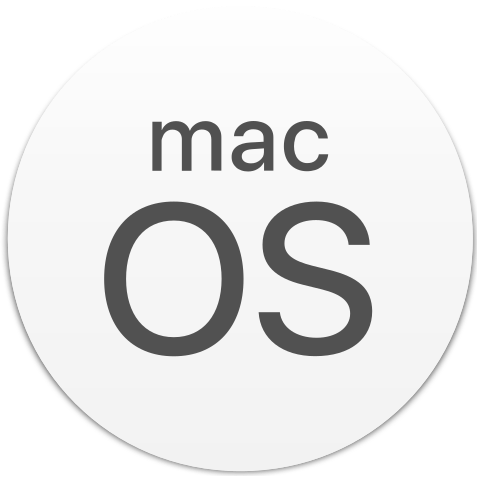
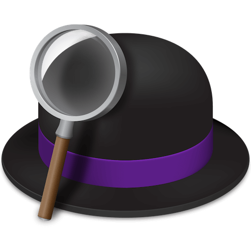
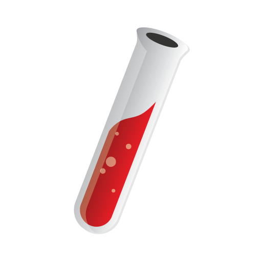

# Introduction

```bash
➜  ~ whoami
➜  ~ Will B Chang. A minimalist and life-long learner.
➜  ~ pwd
➜  ~ /China/Shanghai/
```

## Programming
### OS & Apps
<code><a href="https://www.apple.com/macos/"></a></code>
<code><a href="https://www.alfredapp.com/"></a></code>
<code><a href="https://www.gnu.org/software/emacs/"></a></code>
<code><a href="https://www.jetbrains.com/ruby/"></a></code>

### Languages & Frameworks
<code><a href="https://www.ruby-lang.org/en/"></a></code>
<code><a href="https://jekyllrb.com/"></a></code>
<code><a href="https://nodejs.org/"></a></code>
<code><a href="https://jquery.com"></a></code>

I build and use softwares to make my daily life better, and may make yours too. I learned programming by myself, although I got a bachelor degree from correspondence course at Huazhong Agricultural University.

[code.willbc.cn](https://code.willbc.cn) lists the things I created.

## Psychology
[Counselling Psychology](https://en.wikipedia.org/wiki/Counseling_psychology) is what I want to learn and work with.

[In Treatment](https://en.wikipedia.org/wiki/In_Treatment) is a good drama to represent the work.

I'm preparing the test for applying Master of Applied Psychology.

## Music
<code><a href="https://musescore.org/"></a></code>

[Beethoven](https://en.wikipedia.org/wiki/Ludwig_van_Beethoven) makes me fall in love with Classical Music. I'm also interested in Rock Music because of [JoJo's Bizarre Adventure](https://en.wikipedia.org/wiki/JoJo%27s_Bizarre_Adventure), you should definitely check it.

My lifetime's dream is to become a composer. I'll get a Ph.D of Music Composition in the future.

## Writing
Novel is my favorite since childhood. I started writing(in Chinese) poetry, prose and short stories for personal expression since 2010. [Jean-Christophe](https://en.wikipedia.org/wiki/Jean-Christophe) effects me a lot, I have thoughts about writing a novel relative to it.

Check [Book](https://book.willbc.cn) if you can read Chinese.
