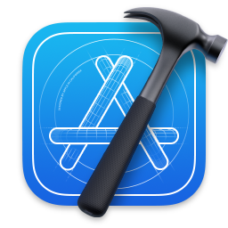

# Introduction

```bash
➜  ~ whoami 
➜  ~ Will B Chang. A minimalist and life-long learner.
➜  ~ pwd
➜  ~ /China/Shanghai/
```

## Programming
[](https://github.com/willbchang)

### OS & Apps
<code><a href="https://www.apple.com/macos/"></a></code>
<code><a href="https://www.alfredapp.com/"></a></code>
<code><a href="https://www.gnu.org/software/emacs/"></a></code>
<code><a href="https://www.jetbrains.com/ruby/"></a></code>
<code><a href="https://developer.apple.com/xcode/"></a></code>

### Languages & Frameworks
Learning and using.
<code><a href="https://www.ruby-lang.org/en/"></a></code>
<code><a href="https://rubyonrails.org/"></a></code>
<code><a href="https://developer.apple.com/swift/"></a></code>
<code><a href="https://developer.apple.com/xcode/swiftui/"></a></code>
<code><a href="https://javascript.info/"></a></code>

I'm building softwares to fill my personal needs, speed up my workflow, and trying to make a living. 

Check [Code](https://code.willbc.cn) for my programming projects.

## Music
I'm a fan of [Beethoven](https://en.wikipedia.org/wiki/Ludwig_van_Beethoven), [Glenn Gould](https://en.wikipedia.org/wiki/Glenn_Gould), I enjoy playing piano and composing music.

My lifetime's dream is to become a composer and I'm tring. I believe I'll get a Ph.D of Music Composition in the future.

Check [Music](https://music.willbc.cn) if you want to listen my music.

## Writing
Novels are my favorite since childhood. I started writing(Chinese) poetry in 2010, also prose and short stories. [Jean-Christophe](https://en.wikipedia.org/wiki/Jean-Christophe) influences me a lot, I have thoughts about writing a novel relative to it.

Check [Book](https://book.willbc.cn) if you can read Chinese.

## What else?
I'm also interested in Psychology, mostly [Psychoanalysis](https://en.wikipedia.org/wiki/Psychoanalysis), [Cognitive Psychology](https://en.wikipedia.org/wiki/Cognitive_psychology), and [Developmental Psychology](https://en.wikipedia.org/wiki/Developmental_psychology). I'd like to get a master degree of Psychology.

My favorite anime is [JoJo's Bizarre Adventure](https://en.wikipedia.org/wiki/JoJo%27s_Bizarre_Adventure), you should definitely check it. 
